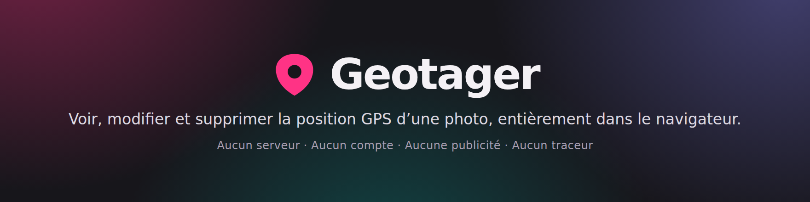

<div align="center">

<a href="https://geotager.app/fr/">
  
</a>

[](https://github.com/MathieuSoysal/geotager/actions/workflows/ci.yml)
[](LICENSE)
[](#linstaller-et-sen-servir-hors-ligne)
[](#points-clés)

**[geotager.app](https://geotager.app/fr/)** · [Guides](https://geotager.app/fr/guides/) · [CLI](#depuis-un-terminal) · [Bibliothèque](#depuis-votre-propre-code) · *[English version](README.md)*

</div>

Voir, modifier et supprimer la position GPS d'une photo, **entièrement dans le navigateur**.

Aucun serveur, aucun compte, aucune publicité, aucun traceur. Le site est un ensemble de fichiers
statiques&nbsp;; le traitement des images a lieu dans un Web Worker, sur votre machine.

Une seule chose va chercher quelque chose au dehors&nbsp;: la carte de «&nbsp;Placer sur une
carte&nbsp;», qui demande ses images à `tile.openstreetmap.org`. Elle reste repliée tant qu'on ne
clique pas dessus&nbsp;: une visite qui ne l'ouvre jamais n'émet aucune requête sortante, et votre
photo n'entre dans aucune, dans un cas comme dans l'autre.

<details>
<summary><b>Sommaire</b></summary>

- [Points clés](#points-clés)
- [Formats pris en charge](#formats-pris-en-charge)
- [Démarrage rapide](#démarrage-rapide)
  - [Dans le navigateur](#dans-le-navigateur)
  - [Depuis un terminal](#depuis-un-terminal)
  - [Depuis votre propre code](#depuis-votre-propre-code)
  - [Depuis un lien](#depuis-un-lien)
  - [Pour les agents IA](#pour-les-agents-ia)
- [Ce que le moteur garantit](#ce-que-le-moteur-garantit)
- [Le site](#le-site)
  - [Les langues](#les-langues)
  - [Les guides](#les-guides)
  - [L'installer, et s'en servir hors ligne](#linstaller-et-sen-servir-hors-ligne)
  - [Lui envoyer une photo depuis le système](#lui-envoyer-une-photo-depuis-le-système)
- [Développement](#développement)
  - [Tests](#tests)
  - [Publier une version](#publier-une-version)
  - [Intégration continue](#intégration-continue)
  - [Contrôles de build](#contrôles-de-build)
- [Déploiement](#déploiement)
- [Contribuer](#contribuer)
- [Licence](#licence)

</details>

## Points clés

- 🔒 **Privé par architecture, pas par promesse.** Des fichiers statiques et un Web Worker&nbsp;;
  votre photo ne quitte jamais votre machine, et un contrôle de build fait échouer le déploiement
  si une page charge un jour une ressource tierce autre que les tuiles de carte autorisées.
- 🧬 **Aucun réencodage, jamais.** Les pixels ne sont jamais touchés. Corriger ou effacer un lieu
  rend un fichier de **taille strictement identique**&nbsp;; en ajouter un ajoute un bloc sans
  déplacer un seul octet existant.
- 🔎 **Preuve à l'octet près.** Le moteur annonce les plages qu'il écrit, le fichier produit est
  comparé à l'original partout ailleurs, et un second moteur indépendant relit le résultat.
- 🎞️ **Les vidéos aussi.** MOV et MP4 rangent leur lieu à plusieurs endroits à la fois&nbsp;; tous
  sont lus, réécrits et effacés ensemble, si bien que le fichier ne se contredit jamais.
- 📦 **Un moteur, trois portes.** Le [site](https://geotager.app/fr/), la
  [ligne de commande `geotager`](#depuis-un-terminal) et la
  [bibliothèque `@geotager/core`](#depuis-votre-propre-code) font passer les mêmes octets par la
  même vérification&nbsp;; il n'existe pas de version allégée.
- 📲 **Installable, et entièrement hors ligne.** Un service worker écrit à la main garde l'outil en
  état de marche sans le moindre réseau, sans jamais mettre une tuile de carte en cache.

## Formats pris en charge

**V1.7&nbsp;: les quatre opérations sur tous les formats, vidéos comprises.**

| Format | Lire | Corriger | Ajouter | Effacer |
|---|---|---|---|---|
| JPEG | oui | oui | oui | oui |
| HEIC, AVIF *(iPhone)* | oui | oui | oui | oui |
| PNG | oui | oui | oui | oui |
| WebP *(forme étendue)* | oui | oui | oui | oui |
| TIFF *(hors fichiers bruts)* | oui | oui | oui | oui |
| Vidéos (MOV, MP4) | oui | oui | oui | oui |

*«&nbsp;Corriger&nbsp;» remplace un lieu déjà présent, «&nbsp;ajouter&nbsp;» en crée un là où il n'y
en a pas. Ce sont deux opérations différentes&nbsp;: la première ne change pas la taille du fichier,
la seconde si. Le tableau de la page d'accueil est rendu depuis `packages/core/src/capacites.ts`,
que le moteur lit aussi&nbsp;; il ne peut donc pas s'écarter de ce que le code sait faire.*

Ajouter n'agrandit rien sur place&nbsp;: sur une photo d'iPhone, le nouveau bloc est ajouté en fin
de fichier et une seule adresse est repointée, si bien qu'aucun octet existant ne bouge. Corriger et
effacer ne déplacent pas un octet du tout&nbsp;: le fichier produit a exactement la taille de
l'original.

Deux limites, dites *avant* l'action et non après&nbsp;: un WebP de forme simple n'a aucun
emplacement prévu pour un lieu, et **un négatif numérique (DNG, NEF, CR2) n'accepte pas qu'on lui
en ajoute un**, parce qu'un négatif est un TIFF et qu'abîmer un original serait irréparable.

**Les vidéos aussi, depuis la V1.7&nbsp;:** MOV et MP4. Une vidéo range son lieu en texte, et non
dans le bloc qu'utilise une photo&nbsp;; et elle le range à plusieurs endroits à la fois&nbsp;: la
forme simple que tous les lecteurs comprennent, la variante de Samsung, les clés nommées d'Apple, et
la forme 3GPP qui écrit la ville **en toutes lettres** à côté des chiffres. Tous sont lus, tous sont
réécrits ensemble, tous sont effacés ensemble. Un fichier dont un rangement dit Avignon et dont
l'autre dit encore San Diego est un mensonge&nbsp;: il n'est jamais produit.

Une limite propre aux vidéos, et c'est la limite honnête&nbsp;: **une caméra d'action enregistre le
chemin parcouru, seconde par seconde, du début à la fin.** Cette trace vit parmi les images
elles-mêmes, que ce moteur ne réécrit jamais&nbsp;; c'est ce qui lui permet de travailler sur un
fichier de 8 Mo sans le décoder. Sur un tel fichier, le lieu peut donc être *montré* mais ni
corrigé, ni ajouté, ni effacé, et cela vous est dit avant que vous n'agissiez, pas après. Changer le
lieu visible en laissant survivre une trace seconde par seconde serait le pire que cet outil puisse
faire.

## Démarrage rapide

Le moteur est un paquet autonome. Le site, la ligne de commande et ce que vous construirez font
passer les mêmes octets par la même vérification.

### Dans le navigateur

Ouvrez **[geotager.app](https://geotager.app/fr/)**. Rien à installer, aucun compte à créer.
Chargez une photo, lisez son lieu, corrigez-le ou effacez-le, puis enregistrez le résultat. Votre
photo ne quitte jamais la page.

### Depuis un terminal

```bash
npx geotager read photo.jpg                              # affiche du JSON
npx geotager set photo.jpg --lat 48.8584 --lng 2.2945    # écrit photo-geotagged.jpg
npx geotager strip '*.heic' --out ./clean                # en lot, originaux intacts
```

Les originaux ne sont jamais écrasés sans `--in-place`. Les motifs sont développés par l'outil
lui-même, donc ils se comportent pareil sous Windows et dans un `spawn()` sans shell. Les codes de
sortie sont `0` réussite, `1` des fichiers ont échoué et sont restés intacts, `2` faute d'usage,
`3` aucun fichier trouvé. `npx geotager --help` documente le reste.

### Depuis votre propre code

```bash
npm install @geotager/core
```

```js
import { readGps, setGps, stripGps } from '@geotager/core';

readGps(bytes);                                     // { lat, lng, alt? } | null
await setGps(bytes, { lat: 48.8584, lng: 2.2945 }); // de nouveaux octets
await stripGps(bytes);                              // de nouveaux octets
```

Des octets entrent, des octets sortent&nbsp;: aucun DOM, aucun système de fichiers, aucun réseau. Le
paquet tourne à l'identique dans Node, dans un navigateur, dans un Web Worker et dans une fonction
de bord. Les écritures lèvent plutôt que de rendre un fichier qui n'a pas passé la vérification&nbsp;;
`applyGps` rend le refus au lieu de le lever, pour les lots.

### Depuis un lien

`?lat=&lng=&zoom=` pré-remplit le champ de coordonnées et centre la carte&nbsp;:

```
https://geotager.app/?lat=48.8584&lng=2.2945&zoom=16
```

Le lien remplit un champ de saisie et rien d'autre&nbsp;: aucun fichier n'est chargé, rien n'est
écrit, et la carte reste fermée tant que personne ne l'ouvre. `lat` et `lng` doivent être présents
et dans les bornes, sinon tout est ignoré en silence&nbsp;: ces adresses sont fabriquées par des
programmes et se font tronquer par les messageries, et un bandeau d'erreur accuserait la mauvaise
personne.

### Pour les agents IA

[`/agent-setup/prompt.md`](public/agent-setup/prompt.md), servi sur
<https://geotager.app/agent-setup/prompt.md>, est un document d'instructions prêt à l'emploi qui
couvre les voies terminal, bibliothèque et lien ci-dessus, écrit pour qu'un modèle puisse agir
directement dessus.

La page d'accueil porte un bouton **«&nbsp;Formez votre agent à Geotager&nbsp;»**, juste sous le
héros&nbsp;: un clic copie une consigne d'une phrase qui envoie l'assistant chercher ce document,
prête à coller dans Claude, Codex, Cursor ou tout autre agent. Le texte copié vit dans
[`src/lib/ui/invite-agent.ts`](src/lib/ui/invite-agent.ts).

## Ce que le moteur garantit

- **Aucun réencodage.** Les pixels ne sont jamais touchés. Seuls les octets de la position changent.
- **Édition sur place quand c'est possible.** Corriger ou effacer une position produit un fichier de
  **taille strictement identique**&nbsp;: rien n'est déplacé, donc MakerNote, vignette, profil
  colorimétrique et segments constructeur sont préservés *par construction*.
- **Création sans réécriture.** Ajouter une position à un fichier qui n'en a pas n'insère rien au
  milieu du bloc TIFF&nbsp;: un nouvel IFD0 est ajouté à la fin et l'en-tête est repointé dessus. Les
  offsets absolus existants restent valides&nbsp;: c'est précisément ce qu'une réécriture classique
  casse.
- **Preuve à l'octet près.** Le moteur annonce les plages qu'il écrit, et le fichier produit est
  comparé à l'original **partout ailleurs**. Une comparaison de tailles ne prouverait rien&nbsp;: un
  défaut qui efface 200&nbsp;Ko de données constructeur la passerait sans un mot. C'est aussi ce qui
  permet d'écrire dans une photo de plusieurs mégaoctets sans jamais la décoder&nbsp;: on ne prouve
  pas que l'image est restée lisible, on prouve que ses octets n'ont pas bougé.
- **Vérification après écriture, en trois temps.** Notre lecteur relit le fichier produit en
  repartant du premier octet. Un **second moteur, écrit par d'autres**, relit le bloc de
  position&nbsp;: c'est là que vit le défaut d'ordre des octets qu'une auto-relecture ne peut pas
  voir. Puis il relit le fichier entier, sous réserve qu'il ait su ouvrir l'original&nbsp;: il ne
  connaît pas tous les formats, et son silence sur un fichier qu'il n'ouvre pas ne prouverait rien.
  Un écart de plus d'un mètre, un résidu après effacement ou un désaccord annulent l'opération et
  rendent l'original intact. **Pour une vidéo, ce second moteur n'existe pas dans un navigateur**
  (aucun des lecteurs que nous pourrions embarquer n'ouvre MOV ni MP4), et il est remplacé par deux
  contrôles à nous&nbsp;: la structure est reparcourue depuis le premier octet et chaque parent doit
  être exactement rempli par ses enfants, et tous les endroits qui portent le lieu doivent
  s'accorder sur la même réponse. Le vrai lecteur indépendant passe en intégration continue, sur de
  vrais fichiers, colonne par colonne. Dit franchement plutôt que laissé à supposer&nbsp;: ce
  contrôle de remplacement, écrit là où aucun test ne l'atteignait, a passé une version à refuser
  toutes les vidéos réelles. Ce qui le tient désormais honnête&nbsp;: il s'éprouve dans les deux
  sens, et le parcours navigateur va jusqu'au fichier produit au lieu de s'arrêter à l'état des
  boutons.
- **Aucune copie oubliée.** Une image peut ranger le lieu une seconde fois dans un paquet de texte
  descriptif. Il est purgé (le lieu seul, pas le titre ni l'auteur), puis **re-balayé**&nbsp;: s'il
  en subsiste la moindre trace, ou si le paquet est compressé et donc illisible pour ce moteur,
  l'effacement échoue plutôt que de rendre un fichier qu'on croirait propre.

## Le site

### Les langues

L'anglais est servi à `/`, le français à `/fr/`. Les deux pages sont rendues depuis les mêmes
composants et la même matrice de capacités&nbsp;; seuls les mots changent, et ils vivent dans
`src/lib/i18n/`. Le moteur ne rend jamais une phrase mais une clé, si bien qu'une traduction
manquante est une erreur de compilation, pas une phrase française sur une page anglaise.

### Les guides

En plus de l'outil, le site publie six guides écrits dans chaque langue&nbsp;: modifier la
géolocalisation d'une photo, la vérifier, la supprimer, en ajouter une, faire tout cela sur un
iPhone, et ce que les réseaux sociaux et les messageries en font réellement. Ils vivent sous
[`/guides/`](https://geotager.app/guides/) et [`/fr/guides/`](https://geotager.app/fr/guides/).

Leur structure est **dérivée**, jamais écrite deux fois. `src/lib/guides/` porte une fiche typée par
langue (le segment d'adresse, le titre, la description, le résumé d'une ligne) et tout le reste
lit d'ici&nbsp;: le sommaire, les liens croisés entre guides, les `hreflang` réciproques, le plan du
site et les contrôles. Un guide ajouté dans une langue et pas dans l'autre est une erreur de
compilation, puisque toute page indexable doit annoncer toutes les langues. La prose, elle, reste
dans la page qui la porte.

Quatre choses sont **imposées au build** plutôt que confiées à la bonne volonté&nbsp;:

- **Rien de mince.** Un guide de moins de 700 mots fait échouer la build. Le compte est affiché pour
  chacun.
- **La réponse d'abord.** Un guide doit s'ouvrir sur un `<p class="reponse">`&nbsp;: une réponse
  directe dans le premier paragraphe, pas un préambule.
- **Aucun orphelin.** Chaque guide doit figurer au sommaire de sa langue, et ramener à l'outil comme
  à ce sommaire.
- **Aucun `@id` dans le vide.** Un guide désigne l'application dans ses données structurées par
  référence plutôt qu'en la redéfinissant&nbsp;; le contrôle résout chaque référence contre les
  identifiants que le site définit vraiment, toutes pages confondues.

Les guides n'embarquent **aucun JavaScript**&nbsp;; le test de bout en bout vérifie les deux
moitiés&nbsp;: aucune balise de script ne subsiste, et aucun module n'est demandé au réseau. Astro
réunit les scripts hissés en un seul paquet&nbsp;: importer la décoration de la page y amènerait
tout l'outil, sur une page qui n'en a pas.

### L'installer, et s'en servir hors ligne

Geotager s'installe, et fonctionne sans le moindre réseau, ce qui est bien le sujet&nbsp;: l'outil
tournait déjà entièrement sur votre appareil, et la seule raison pour laquelle il cessait de marcher
hors ligne, c'est que personne n'en gardait de copie.

**Un bouton «&nbsp;Installer l'application&nbsp;» apparaît dans la barre du haut, et seulement quand
il peut servir à quelque chose.** Il est `hidden` dans le HTML servi, et seule l'invitation du
navigateur le découvre, invitation qu'aucun navigateur n'émet quand l'application est déjà
installée. Il est donc absent pour qui l'a installée, absent dans la fenêtre installée, et absent là
où l'installation n'existe pas&nbsp;; le menu du navigateur y reste le chemin. Rien n'est mémorisé si
vous refermez la boîte&nbsp;: ce site ne persiste rien, et le navigateur décide déjà lui-même de la
fréquence à laquelle il repropose.

L'application *demande* d'ailleurs plutôt que de déduire&nbsp;: le manifeste liste ses deux propres
adresses sous `related_applications`, si bien que `getInstalledRelatedApps()` peut confirmer
l'installation même depuis un onglet ordinaire, le seul cas où déduire de l'absence d'invitation
pouvait se tromper.

Un service worker écrit à la main (`scripts/sw-modele.js`, ~120 lignes, sans Workbox) précharge les
deux pages, la feuille de style, l'interface et le worker de lecture. Trois règles le gouvernent&nbsp;:

- **Rien qui ne soit de l'origine.** La première ligne du gestionnaire `fetch` rend la main pour tout
  le reste. Une tuile de carte mise en cache écrirait sur le disque la trace durable des lieux
  consultés, exactement ce que ce site promet de ne pas faire.
- **Aucun `skipWaiting()` inconditionnel.** Rien n'est persisté ici&nbsp;: un rechargement imposé
  détruirait les photos chargées et non téléchargées. Une nouvelle version attend derrière un
  bandeau, et une fenêtre qui n'a rien demandé ne se recharge pas parce qu'une autre a dit oui.
- **Pas de page «&nbsp;hors ligne&nbsp;».** Les deux vraies pages sont préchargées&nbsp;; il ne reste
  aucune navigation qu'un secours pourrait rattraper.

La liste de préchargement est dérivée de ce que la build a réellement produit, jamais écrite à la
main, et `scripts/gen-sw.mjs` refuse de produire un worker dont la liste omettrait le worker de
lecture ou la feuille de style.

### Lui envoyer une photo depuis le système

Une fois installé, Geotager apparaît dans le menu de partage du système et comme application
d'«&nbsp;Ouvrir avec&nbsp;» pour les images.

«&nbsp;Ouvrir avec&nbsp;» est le cas simple&nbsp;: le système remet une poignée de fichier, il n'y a
donc rien à transporter et rien à garder.

Simple ne veut pas dire sans risque, et c'est là que cette phrase s'arrêtait. Une poignée peut
désigner un fichier déplacé depuis, ou un fichier qui n'est pas encore descendu d'un espace de
stockage distant, et le système ne remet le lot qu'une fois, il n'y a rien à revenir chercher.
Chaque poignée est donc ouverte pour elle-même, avec un délai&nbsp;: une photo partie n'emporte plus
celles qui sont restées, et une ouverture dont rien n'est utilisable le dit à l'écran et à voix haute
au lieu de laisser une fenêtre vide. Un lancement sans aucun fichier, lui, se tait&nbsp;: c'est à cela
que ressemble un clic sur l'icône de l'application.

Le manifeste dit aussi dans quelle fenêtre les fichiers sont posés&nbsp;: celle qui est déjà ouverte,
mise au premier plan telle quelle, les nouvelles photos **rejoignant** celles qui y étaient au lieu
de les remplacer. Rien n'est persisté ici&nbsp;: un lancement qui renaviguerait la fenêtre
abandonnerait du travail, ce qui est la raison pour laquelle les mises à jour attendent derrière un
bandeau. Le manifeste lui-même se demande au réseau d'abord&nbsp;: c'est le seul fichier que le
système lit pour son compte, et servi depuis le cache une correction ne l'atteindrait jamais.

Le partage, non. L'API de cible de partage livre les fichiers en `POST`, et aucun serveur n'est là
pour le recevoir&nbsp;; c'est le service worker qui l'intercepte. Toutes les autres applications qui
font ceci déposent le fichier dans le stockage de cache, redirigent, puis le relisent et l'effacent.
Cela marche à tous les coups, et cela écrit aussi la photo de quelqu'un sur son disque, ce que ce
site affirme partout ne pas faire. Les octets restent donc dans une variable du worker, et la page
vient les réclamer par un canal de message. Le prix est honnête&nbsp;: si le navigateur arrête le
worker avant (mémoire basse, arbitrage du système), la photo n'arrive pas et la page le dit. On perd
un geste, jamais un fichier&nbsp;; l'original n'a pas bougé de la galerie.

Le partage vaut pour Android et Chrome/Edge sur ordinateur&nbsp;; iOS ne l'implémente pas.
L'ouverture de fichiers vaut pour Chrome/Edge sur ordinateur.

## Développement

```bash
npm install
npm run dev        # serveur local
npm run build      # construit dist/, génère sw.js, puis exécute les contrôles bloquants
npm run icons      # régénère public/icons/, og.png et les bannières du README (committés ; nécessite Playwright)
```

`npm run verifier:en-ligne` va chercher le site en ligne et échoue si l'hébergeur y a injecté quoi
que ce soit (un beacon de mesure d'audience, un point de terminaison `/cdn-cgi/`, Rocket Loader,
Zaraz, un cookie), ou si un en-tête servi diffère de `public/_headers`. Tous les autres contrôles du
dépôt regardent `dist/` et ne peuvent donc pas voir ce qui est ajouté en chemin. Il est
délibérément hors de `npm run build` (la build de Cloudflare n'a rien à interroger) et hors de
`npm run test:all` (l'intégration continue ne doit atteindre aucun réseau).

### Tests

```bash
npm run fixtures   # récupère de vraies photos de test (non committées)
npm test           # moteur EXIF, avec ExifTool comme oracle indépendant : 722 assertions
npm run test:api   # la façade publique de @geotager/core, même oracle : 57 assertions
npm run test:cli   # la ligne de commande geotager, en la lançant : 82 assertions
npm run test:e2e   # parcours complet dans Chromium, fichiers relus par ExifTool : 359 assertions
npm run test:all   # la chaîne entière
```

`test:api` et `test:cli` existent parce que la frontière du paquet est la seule partie du dépôt
dont une rupture ne se verrait pas dans le site. `test:cli` lance un vrai processus plutôt que
d'importer quoi que ce soit&nbsp;: un code de sortie, la séparation des deux flux et le développement
des motifs n'existent pas à l'intérieur d'un appel de fonction.

Chaque case du tableau ci-dessus est adossée à un test qui l'exécute réellement sur une vraie photo
de ce format, y compris les cases à «&nbsp;pas encore&nbsp;», dont le test exige qu'aucun fichier
témoin n'existe. Ce n'est donc plus une discipline mais une propriété&nbsp;: une case ouverte sans
preuve fait échouer la chaîne.

ExifTool est requis pour les tests (`apt install libimage-exiftool-perl`). Il n'est **jamais**
utilisé par l'application&nbsp;: il sert d'oracle externe, parce qu'un moteur qui se relit lui-même
ne prouve rien&nbsp;: un encodeur et un décodeur symétriquement faux s'accordent parfaitement.
libheif (`apt install libheif-examples`, plus ses greffons de décodage) joue le même rôle pour le
décodage&nbsp;: ExifTool dit ce qu'un fichier *contient*, libheif dit qu'il se *décode* encore.

Le corpus n'est pas committé et n'est pas fabriqué&nbsp;: ce sont de vraies photos d'appareils réels
(iPhone 11 Pro Max, iPhone 11 Pro, Nokia 8.3, Galaxy S10, Pixel 4a, HTC Desire, Nikon), plus
quatre vrais négatifs numériques (DNG, NEF, CR2, et un Kodak DCS dont le nom de fichier dit `.TIF`).
Un fichier généré pour l'occasion valide le code contre lui-même&nbsp;; seule une photo réellement
sortie d'un appareil expose les cas qui cassent, et ce corpus-là en expose plusieurs&nbsp;: ordre
des octets inversé, bloc rangé en fin de fichier, coordonnées à zéro, préambule parasite. Aucun
corpus public ne fournissant de PNG ni de TIFF géolocalisé, le lieu de départ y est inscrit par
ExifTool, une implémentation indépendante de la nôtre, dans un vrai fichier d'appareil. Sources et
licences dans [`CREDITS.md`](CREDITS.md).

### Publier une version

`.github/workflows/cd.yml` publie les deux paquets sur npm quand une **publication GitHub
paraît**. Pas à la fusion&nbsp;: une version npm est immuable, si bien que publier à chaque fusion
échouerait sur toutes celles qui ne changent pas le numéro, et réussirait irrémédiablement sur
celles qui le changent.

Trois refus tombent avant le premier octet envoyé&nbsp;: l'étiquette doit dire la même chose que les
deux manifestes, la dépendance de la ligne de commande doit accepter le cœur qu'on publie, et
toute la chaîne de tests doit repasser sur le commit étiqueté. Le cœur part ensuite en premier
(la ligne de commande en dépend), avec `--provenance`, qui lie publiquement le paquet à ce
dépôt et à ce commit. Enfin le paquet *publié* est installé depuis npm et mis à lire une vraie
photo&nbsp;: c'est le seul contrôle qui attrape un `files` trop étroit ou un `bin` qui a perdu son
droit d'exécution.

Pour publier&nbsp;: porter `version` au même numéro dans les deux `packages/*/package.json`,
fusionner, puis publier une release GitHub étiquetée `v<ce numéro>`.

Un secret est nécessaire&nbsp;: `NPM_TOKEN`, un jeton d'automatisation granulaire ayant le droit
d'écrire sur `@geotager/core` et `geotager`, rangé dans l'environnement `npm`. Y ajouter des
relecteurs obligatoires si l'on veut une main humaine avant toute publication.

`workflow_dispatch` rejoue le même travail avec `--dry-run` par défaut, pour éprouver le
workflow sans rien publier.

### Intégration continue

`.github/workflows/ci.yml` installe les oracles externes et rejoue `npm run test:all` sur chaque
proposition de modification. Sans cela, la matrice ci-dessus ne serait vérifiée par rien
d'automatique&nbsp;: la build Cloudflare ne lance que `npm run build`, et son image ne contient ni
ExifTool ni libheif.

### Contrôles de build

`scripts/check-build.mjs` échoue **en code non nul**, la seule chose que Cloudflare lise, si&nbsp;:

- une ressource tierce est chargée depuis un hôte absent de la liste blanche des ressources, qui
  compte exactement une entrée&nbsp;: les tuiles de la carte, consignée dans `CREDITS.md`&nbsp;;
- un fichier JavaScript servi contient une URL absolue dont l'hôte n'est sur aucune liste (les
  motifs ci-dessus ne voient que des formes HTML et CSS&nbsp;; une URL construite par concaténation
  leur échappait)&nbsp;;
- un `<title>` dépasse 60 caractères ou une meta description 155&nbsp;;
- une page n'a pas exactement un `<h1>`&nbsp;;
- un des blocs de contenu obligatoires manque du HTML servi, dans la langue de la page&nbsp;;
- une page n'annonce pas toutes les langues, elle comprise, plus `x-default`&nbsp;;
- le tableau d'un README contredit le tableau réellement servi&nbsp;;
- le JavaScript dépasse 150 Ko gzip&nbsp;;
- un `X-Robots-Tag` apparaît sous un motif relatif dans `_headers`&nbsp;;
- l'action `file_handlers` du manifeste ne désigne pas une page servie sans redirection, ou le
  champ jamais normalisé `launch_type` réapparaît à côté de `launch_handler`&nbsp;;
- `robots.txt` interdit le parcours, ou annonce un plan du site que la build ne produit pas, ce
  qui est arrivé une fois, sans que rien ne s'en aperçoive&nbsp;;
- le plan du site n'annonce pas exactement les pages indexables, porte un `changefreq` ou un
  `priority` que les moteurs ignorent de toute façon, ou déclare des langues qui contredisent les
  `hreflang` de la page&nbsp;;
- le canonique d'une page ne pointe pas sur elle-même, ou `og:url` le contredit&nbsp;;
- le JSON-LD d'une page n'est pas du JSON valide, ou cesse de décrire l'application, le site et son
  éditeur&nbsp;;
- une page indexable porte `noindex`, ou la page 404 le perd&nbsp;;
- le garde-fou de déploiement a été retiré du dépôt.

## Déploiement

Cloudflare Workers avec assets statiques, en intégration Git. `wrangler.jsonc` ne déclare aucun
champ `main`&nbsp;: il n'y a pas de code Worker, seulement des fichiers servis.

`scripts/deploy.mjs` décide, d'après la branche construite, s'il téléverse une version ou promeut
en production, une décision qui ne vivait auparavant que dans un réglage du tableau de bord et qui
a un jour mis en ligne du code non relu. Pour qu'il protège quoi que ce soit, **les deux** commandes
de build du tableau de bord doivent être `npm run deploy`.

## Contribuer

Rapports de bogue, corrections, connaissance des formats, reformulations et traductions sont tous
bienvenus. Commencez par [`CONTRIBUTING.md`](CONTRIBUTING.md)&nbsp;: il explique les promesses que
tout changement doit tenir (la plupart sont imposées par la build), comment lancer la chaîne de
tests, et à quoi ressemble un bon rapport de bogue. En bref&nbsp;: ne joignez jamais une photo dont
le lieu vous gênerait s'il était publié.

Questions et problèmes vont au
[suivi des tickets](https://github.com/MathieuSoysal/geotager/issues)&nbsp;; ce que vous croyez
exploitable passe par le [signalement privé de vulnérabilité](SECURITY.md). Toute personne qui
interagit avec le projet est tenue de suivre le [code de conduite](CODE_OF_CONDUCT.md).

## Licence

[MIT](LICENSE). Sur un outil qui affirme ne rien envoyer, un code lisible est le seul argument que
vous pouvez vérifier vous-même.
