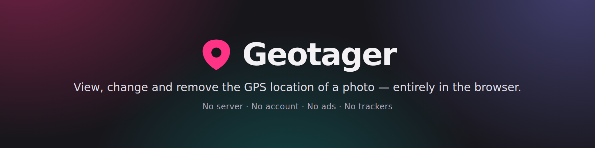

<div align="center">

<a href="https://geotager.app">
  
</a>

[](https://github.com/MathieuSoysal/geotager/actions/workflows/ci.yml)
[](#licence)
[](#installing-it-and-using-it-offline)
[](#highlights)

**[geotager.app](https://geotager.app)** · [Guides](https://geotager.app/guides/) · [CLI](#from-a-terminal) · [Library](#from-your-own-code) · *[Version française](README.fr.md)*

</div>

View, change and remove the GPS location of a photo, **entirely in the browser**.

No server, no account, no ads, no trackers. The site is a set of static files; image processing
happens in a Web Worker, on your machine.

One thing, and one only, reaches outside: the map behind “Place it on a map”, which fetches its
pictures from `tile.openstreetmap.org`. It is folded away until you click it, so a session that
never opens it makes no outside request at all — and your photo is never part of one either way.

<details>
<summary><b>Table of contents</b></summary>

- [Highlights](#highlights)
- [Supported formats](#supported-formats)
- [Quick start](#quick-start)
  - [In the browser](#in-the-browser)
  - [From a terminal](#from-a-terminal)
  - [From your own code](#from-your-own-code)
  - [From a link](#from-a-link)
  - [For AI agents](#for-ai-agents)
- [What the engine guarantees](#what-the-engine-guarantees)
- [The website](#the-website)
  - [Languages](#languages)
  - [The guides](#the-guides)
  - [Installing it, and using it offline](#installing-it-and-using-it-offline)
  - [Sending a photo to it from the system](#sending-a-photo-to-it-from-the-system)
- [Development](#development)
  - [Tests](#tests)
  - [Releasing](#releasing)
  - [Continuous integration](#continuous-integration)
  - [Build checks](#build-checks)
- [Deployment](#deployment)
- [Licence](#licence)

</details>

## Highlights

- 🔒 **Private by architecture, not by promise.** Static files plus a Web Worker; your photo never
  leaves your machine, and a build check fails the deployment if any page ever loads a third-party
  resource.
- 🧬 **No re-encoding, ever.** Pixels are never touched. Changing or removing a location returns a
  file of **strictly identical size**; adding one appends a block without moving a single existing
  byte.
- 🔎 **Byte-exact proof.** The engine declares the ranges it writes, the produced file is compared
  to the original everywhere else, and an independent second engine re-reads the result.
- 🎞️ **Videos too.** MOV and MP4 keep their location in several places at once; all of them are
  read, rewritten and removed together, so the file never contradicts itself.
- 📦 **One engine, three doors.** The [website](https://geotager.app), the
  [`geotager` CLI](#from-a-terminal) and the [`@geotager/core` library](#from-your-own-code) run
  the same bytes through the same verification — there is no “lite” version.
- 📲 **Installable, and fully offline.** A hand-written service worker keeps the tool working with
  no network at all, without ever caching a map tile.

## Supported formats

**V1.7 — all four operations on every format, videos included.**

| Format | Read | Change | Add | Remove |
|---|---|---|---|---|
| JPEG | yes | yes | yes | yes |
| HEIC, AVIF *(iPhone)* | yes | yes | yes | yes |
| PNG | yes | yes | yes | yes |
| WebP *(extended form)* | yes | yes | yes | yes |
| TIFF *(excluding camera raw)* | yes | yes | yes | yes |
| Videos (MOV, MP4) | yes | yes | yes | yes |

*“Change” replaces a location that is already there, “add” creates one where there is none. They are
two different operations: the first does not change the file size, the second does. The table on
each page is rendered from `packages/core/src/capacites.ts`, which the engine reads too, so it cannot
drift from what the code can actually do.*

Adding grows nothing in place: on an iPhone photo, the new block is appended at the end of the file
and a single address is repointed, so no existing byte moves. Changing and removing move no byte at
all: the file produced is exactly the size of the original.

Two limits, announced *before* you act rather than after: a simple-form WebP has nowhere to put a
location, and **a camera raw file — DNG, NEF, CR2 — will not accept having one added**, because a
raw file is a TIFF and damaging an original would be irreversible.

**Videos too, since V1.7** — MOV and MP4. A video keeps its location as text rather than in the
block a photo uses, and it keeps it in several places at once: the plain form every player reads,
Samsung's variant, Apple's named keys, and the 3GPP form that writes the town out **in words** next
to the numbers. All of them are read, all of them are rewritten together, and all of them are
removed together. A file whose one place says Avignon and whose other still says San Diego is a lie,
so it is never produced.

One video limit, and it is the honest one: **an action camera records where it went, second by
second, from beginning to end.** That trail lives among the images themselves, which this engine
never rewrites — that is what lets it work on an 8 MB file without decoding it. So on such a file
the location can be *shown* but not changed, added or removed, and you are told so before you touch
anything, not after. Changing the visible location while a second-by-second trail survives would be
the worst thing this tool could do.

## Quick start

The engine is a standalone package. The website, the command line and anything you build all run
the same bytes through the same verification.

### In the browser

Open **[geotager.app](https://geotager.app)** — nothing to install, nothing to create an account
for. Load a photo, read its location, change it or remove it, and save the result. Your photo
never leaves the page.

### From a terminal

```bash
npx geotager read photo.jpg                              # prints JSON
npx geotager set photo.jpg --lat 48.8584 --lng 2.2945    # writes photo-geotagged.jpg
npx geotager strip '*.heic' --out ./clean                # batch, originals untouched
```

Originals are never overwritten unless you pass `--in-place`. Globs are expanded by the tool
itself, so they behave the same on Windows and inside a `spawn()` with no shell. Exit codes are
`0` success, `1` some files failed and were left untouched, `2` usage error, `3` nothing matched.
`npx geotager --help` documents the rest.

### From your own code

```bash
npm install @geotager/core
```

```js
import { readGps, setGps, stripGps } from '@geotager/core';

readGps(bytes);                                     // { lat, lng, alt? } | null
await setGps(bytes, { lat: 48.8584, lng: 2.2945 }); // new bytes
await stripGps(bytes);                              // new bytes
```

Bytes in, bytes out — no DOM, no filesystem, no network. It runs unchanged in Node, in a browser,
in a Web Worker and in an edge function. Writes throw rather than return a file that failed
verification; `applyGps` returns the refusal as a value instead, for batches.

### From a link

`?lat=&lng=&zoom=` pre-fills the coordinate field and centres the map:

```
https://geotager.app/?lat=48.8584&lng=2.2945&zoom=16
```

It fills a text field and nothing else — no file is loaded, nothing is written, and the map stays
closed until asked for. Both `lat` and `lng` must be present and in range, or the whole thing is
ignored in silence: these links are built by programs and get truncated by messaging apps, and an
error banner would accuse the wrong person.

### For AI agents

[`/agent-setup/prompt.md`](public/agent-setup/prompt.md) — served at
<https://geotager.app/agent-setup/prompt.md> — is a ready-to-use instruction document covering all
three paths above, written so a model can act on it directly.

## What the engine guarantees

- **No re-encoding.** Pixels are never touched. Only the bytes of the location change.
- **In-place editing where possible.** Changing or removing a location produces a file of
  **strictly identical size**: nothing moves, so MakerNote, thumbnail, colour profile and vendor
  segments survive *by construction*.
- **Creation without rewriting.** Adding a location to a file that has none inserts nothing in the
  middle of the TIFF block: a new IFD0 is appended at the end and the header is repointed at it.
  Existing absolute offsets stay valid — which is precisely what a naive rewrite breaks.
- **Byte-exact proof.** The engine declares the ranges it writes, and the file produced is compared
  to the original **everywhere else**. Comparing sizes would prove nothing: a defect wiping 200 KB
  of vendor data would sail straight through. It is also what lets us write into a photo of several
  megabytes without ever decoding it: we do not prove the image is still readable, we prove its
  bytes did not move.
- **Verification after writing, in three stages.** Our reader reads the file back from the first
  byte. A **second engine, written by other people**, reads the location block — that is where the
  byte-order defect lives, the one a self-recheck cannot see. Then it reads the whole file, provided
  it could open the original: it does not know every format, and its silence about a file it cannot
  open would prove nothing. A gap of more than a metre, a residue after removal, or a disagreement
  cancels the operation and hands the original back intact.
  **For a video that second engine does not exist in a browser** — none of the readers
  we could ship opens MOV or MP4 — so it is replaced by two checks of our own: the structure is
  walked again from the first byte and every parent must be exactly filled by its children, and all
  the places that carry the location must agree on the same answer. The genuine independent oracle
  runs in continuous integration, on real files, column by column. Said plainly rather than left to
  be assumed: that replacement check, written where no test could reach it, spent a release refusing
  every real video. What now keeps it honest: it is exercised in both directions, and the browser
  journey clicks through to the produced file instead of stopping at the state of the buttons.
- **No forgotten copy.** An image can keep the location a second time in a descriptive text packet.
  It is purged — the location only, not the title or the author — then **swept again**: if any trace
  survives, or if the packet is compressed and therefore unreadable to this engine, the removal
  fails rather than hand back a file you would believe was clean.

## The website

### Languages

English is served at `/`, French at `/fr/`. Both pages are rendered from the same components and the
same capability matrix; only the words differ, and they live in `src/lib/i18n/`. The engine never
returns a sentence — it returns a key — so a missing translation is a compile error, not a French
sentence on an English page.

### The guides

Beyond the tool, the site publishes six written guides in each language — changing a photo's
location, checking it, removing it, adding one, doing all of that on an iPhone, and what social
networks and messaging apps actually do with it. They live at
[`/guides/`](https://geotager.app/guides/) and [`/fr/guides/`](https://geotager.app/fr/guides/).

Their structure is derived, never written twice. `src/lib/guides/` holds one typed record per
language — the URL segment, the title, the description, the one-line summary — and everything else
reads from it: the contents page, the cross-links between guides, the reciprocal `hreflang`, the
sitemap, and the checks. A guide added in one language and not the other is a compile error, because
every indexable page must declare every language. The prose itself stays in the page that carries it.

Four things are enforced at build time rather than trusted:

- **Nothing thin.** A guide under 700 words fails the build. The count is printed for each one.
- **The answer first.** A guide must open with a `<p class="reponse">` — a direct answer in its first
  paragraph, not a preamble.
- **No orphans.** Every guide must be listed on the contents page of its own language, and must link
  back to the tool and to that contents page.
- **No dangling `@id`.** A guide names the application in its structured data by reference rather
  than redefining it; the check resolves every reference against the identifiers the site actually
  defines, across all pages.

Guides ship **no JavaScript at all** — the end-to-end test asserts both that no script tag survives
and that no module is fetched. Astro bundles hoisted scripts together, so importing the page
decoration would drag the whole tool along with it, onto a page that has no tool.

### Installing it, and using it offline

Geotager is installable, and it works with no network at all — which is the point: the tool already
ran entirely on your device, and the only reason it used to stop working offline is that nothing
kept a copy of it.

**An “Install the app” button appears in the top bar, and only when it can do something.** It ships
`hidden` in the served HTML and is revealed solely by the browser's install prompt — which browsers
do not fire when the app is already installed. So it is absent for anyone who has installed it,
absent inside the installed window, and absent in browsers that cannot install at all; there, the
browser's own menu remains the way in. Nothing is remembered if you dismiss the dialog: this site
persists nothing, and the browser already decides how often to offer again.

The app also *asks* rather than infers: the manifest lists its own two manifest URLs under
`related_applications`, so `getInstalledRelatedApps()` can confirm the app is installed even from an
ordinary tab — the one case where inferring from a missing install event could be wrong.

A hand-written service worker (`scripts/sw-modele.js`, ~120 lines, no Workbox) precaches both pages,
the stylesheet, the interface and the reading worker. Three rules govern it:

- **Nothing that is not same-origin.** The first line of the `fetch` handler hands back control for
  anything else. A cached map tile would write a durable on-disk record of the places you looked at,
  which is exactly what this site promises not to do.
- **No unconditional `skipWaiting()`.** Nothing is persisted here, so a forced reload would destroy
  photos you have loaded and not yet downloaded. A new version waits behind a banner until you say so
  — and a window that did not ask is not reloaded because another one said yes.
- **No offline fallback page.** Both real pages are precached, so there is no navigation left for a
  fallback to catch.

The precache list is derived from what the build actually produced — never written by hand — and
`scripts/gen-sw.mjs` refuses to emit a worker whose list is missing the reading worker or the
stylesheet.

### Sending a photo to it from the system

Once installed, Geotager appears in the OS share sheet and as an “Open with” handler for images.

“Open with” is the simple one: the system hands over a file handle, so there is nothing to carry
and nothing to keep.

Simple is not the same as safe, and this is where that sentence used to stop. A handle can point at
a file that has moved since, or at one that has not come down from online storage yet — and the
system hands the batch over exactly once, so there is nothing to come back for. Each handle is
therefore opened on its own, with a time limit: one photo that has gone missing no longer takes the
rest of the batch with it, and an “Open with” that yields nothing usable says so on screen and out
loud instead of leaving an empty window. A launch with no files at all stays silent, because that is
what clicking the app's own icon looks like.

The manifest also states which window receives the files: the one already open, brought forward as
it is, with the new photos **joining** the ones already loaded rather than replacing them. Nothing
is persisted here, so a launch that navigated the window would discard work — the same reason
updates wait behind a banner. The manifest itself is fetched from the network first: it is the only
file the system reads on its own behalf, and served from cache a correction to it would never
arrive.

Sharing is not. The Web Share Target API delivers files as a `POST`, and there is no server here to
receive one — the service worker intercepts it. Every other app that does this parks the file in
Cache Storage, redirects, then reads it back and deletes it. That always works, and it also writes
someone's photo to their disk, which this site says everywhere that it does not do. So the bytes
stay in a variable in the worker instead, and the page claims them over a `MessageChannel`. The
price is honest: if the browser stops the worker first — low memory, system arbitration — the photo
does not arrive and the page says so. You lose a gesture, never a file; the original never moved
from the gallery.

Share target is Android and desktop Chrome/Edge; iOS does not implement it. File handling is
desktop Chrome/Edge.

## Development

```bash
npm install
npm run dev        # local server
npm run build      # builds dist/, generates sw.js, then runs the blocking checks
npm run icons      # regenerates public/icons/, og.png and the README banners (committed; needs Playwright)
```

`npm run verifier:en-ligne` fetches the live site and fails if the host has injected anything into
it — a Cloudflare analytics beacon, `/cdn-cgi/` endpoints, Rocket Loader, Zaraz, a cookie — or if any
served header differs from `public/_headers`. Every other check in this repository looks at `dist/`
and therefore cannot see what is added on the way out. It is deliberately outside `npm run build`
(Cloudflare's build has nothing to fetch) and outside `npm run test:all` (CI must reach no network).

### Tests

```bash
npm run fixtures   # fetches real test photos (not committed)
npm test           # EXIF engine, with ExifTool as an independent oracle — 722 assertions
npm run test:api   # the @geotager/core public surface, same oracle — 57 assertions
npm run test:cli   # the geotager command line, by launching it — 82 assertions
npm run test:e2e   # full journey in Chromium, files read back by ExifTool — 359 assertions
npm run test:all   # the whole chain
```

`test:api` and `test:cli` exist because the package boundary is the one part of this repository
whose breakage would not show up in the website. `test:cli` launches a real process rather than
importing anything: an exit code, the separation of stdout from stderr, and glob expansion do not
exist inside a function call.

Every cell of the table above is backed by a test that actually performs the operation on a real
photo of that format — including the “not yet” cells, whose test requires that no witness file
exists. It is therefore no longer a discipline but a property: opening a cell without proof fails
the chain.

ExifTool is required for the tests (`apt install libimage-exiftool-perl`). It is **never** used by
the application: it serves as an external oracle, because an engine that reads itself back proves
nothing — an encoder and a decoder that are symmetrically wrong agree perfectly. libheif
(`apt install libheif-examples` plus its decoder plugins) plays the same role for decoding: ExifTool
says what a file *contains*, libheif says it still *decodes*.

The corpus is not committed and not fabricated: these are real photos from real devices — iPhone 11
Pro Max, iPhone 11 Pro, Nokia 8.3, Galaxy S10, Pixel 4a, HTC Desire, Nikon — plus four real digital
negatives (DNG, NEF, CR2, and a Kodak DCS whose filename says `.TIF`). A file generated for the
occasion validates the code against itself; only a photo that genuinely came out of a device exposes
the cases that break, and this corpus exposes several: reversed byte order, a block stored at the
end of the file, zeroed coordinates, a parasitic preamble. As no public corpus provides a geotagged
PNG or TIFF, the starting location is written into a real device file by ExifTool — an
implementation independent of ours. Sources and licences in [`CREDITS.md`](CREDITS.md).

### Releasing

`.github/workflows/cd.yml` publishes both packages to npm when a **GitHub release is
published**. Not on merge: an npm version is immutable, so publishing on every merge would
fail on the ones that do not bump the number and succeed irreversibly on the ones that do.

Three refusals run before a single byte is sent — the release tag must match both manifests,
the CLI's dependency range must accept the core being published, and the whole test chain
must pass again on the tagged commit. Then core is published first (the CLI depends on it),
with `--provenance` so the tarball is publicly linked to this repository and commit. Finally
the *published* package is installed from npm and made to read a real photo — the only check
that covers a too-narrow `files` list or a `bin` that lost its executable bit.

To cut a release: bump `version` in both `packages/*/package.json` to the same number, merge,
then publish a GitHub release tagged `v<that number>`.

One secret is required: `NPM_TOKEN`, a granular automation token with write access to
`@geotager/core` and `geotager`, stored on the `npm` environment. Add required reviewers to
that environment if you want a human gate before anything is published.

`workflow_dispatch` runs the same job with `--dry-run` on by default, to exercise the
workflow without publishing.

### Continuous integration

`.github/workflows/ci.yml` installs the external oracles and replays `npm run test:all` on every
proposed change. Without it the matrix above would be verified by nothing automatic: the Cloudflare
build only runs `npm run build`, and its image contains neither ExifTool nor libheif.

### Build checks

`scripts/check-build.mjs` exits **non-zero** — the only thing Cloudflare reads — if:

- a page loads a third-party resource from a host that is not on the resource allowlist — which
  holds exactly one entry, the map tiles, recorded in `CREDITS.md`;
- a served JavaScript file contains an absolute URL whose host is on no list at all (the regexes
  above only see HTML- and CSS-shaped references; a URL built by concatenation escaped them);
- a `<title>` exceeds 60 characters or a meta description 155;
- a page does not have exactly one `<h1>`;
- one of the required content blocks is missing from the served HTML, in that page's language;
- a page fails to declare every language, itself included, plus `x-default`;
- a README's table disagrees with the table actually served;
- JavaScript exceeds 150 KB gzipped;
- an `X-Robots-Tag` appears under a relative pattern in `_headers`;
- the manifest's `file_handlers` action does not resolve to a page that is served without a
  redirect, or the never-standardized `launch_type` reappears beside `launch_handler`;
- `robots.txt` disallows crawling, or advertises a sitemap the build does not produce — which is
  exactly what happened once, and went unnoticed;
- the sitemap does not list precisely the indexable pages, carries a `changefreq` or `priority`
  that search engines ignore anyway, or declares languages that contradict the page's own
  `hreflang`;
- a page's canonical is not self-referencing, or `og:url` disagrees with it;
- a page's JSON-LD is not valid JSON, or stops describing the application, the site and its
  publisher;
- an indexable page carries `noindex`, or the 404 page loses it;
- the deployment guard has been removed from the repository.

## Deployment

Cloudflare Workers with static assets, through the Git integration. `wrangler.jsonc` declares no
`main` field: there is no Worker code, only files being served.

`scripts/deploy.mjs` decides, from the branch being built, whether to upload a version or promote to
production — a decision that used to live only in a dashboard setting, and that once put unreviewed
code online. For it to protect anything, **both** build commands in the dashboard must be
`npm run deploy`.

## Licence

MIT. On a tool that claims to send nothing anywhere, readable code is the only argument you can
check for yourself.
